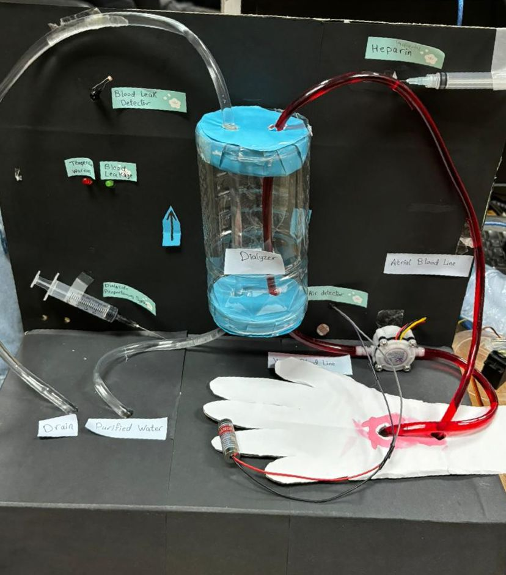

# Hemodialysis Machine Project

## Overview

This project involves the development of a hemodialysis machine using Arduino microcontroller. The machine consists of two main circuits: the dialysate circuit and the blood circuit. Each circuit is designed to monitor and control specific aspects of the dialysis process to ensure patient safety and treatment efficacy.

## Features

- **Dialysate Circuit:**
  - **Temperature Control:** DS18B20 Waterproof Temperature Sensor monitors dialysate temperature. Heating pad activates via relay if temperature falls below a set threshold.
  - **Leak Detection:** Laser and LDR sensor detect blood leakage; activates alarm and stops pump upon detection.
  
- **Blood Circuit:**
  - **Flow Monitoring:** YFS401 Water Flow Sensor continuously monitors blood flow rate.
  - **Air Bubble Detection:** Laser and LDR sensor detect air bubbles in the blood line; servo-controlled clamp closes upon detection.
  
- **Safety Features:**
  - **Alarm System:** Buzzer and LED indicators for temperature alarms and circuit anomalies.
  
## Components

1. [DS18B20 Waterproof Temperature Sensor](https://www.ram-e-shop.com/ar/shop/wire-ds18b20-ds18b20-waterproof-temperature-sensor-7175)
2. [Laser Modules](https://makerselectronics.com/product/laser-module-5v)
3. [LDR Sensors](https://www.ram-e-shop.com/ar/shop/ldr-big-20mm-ldr-big-20mm-photoresistor-cds-5936)
4. [DC Pumps](https://www.ram-e-shop.com/ar/shop/dc-pump-6vdc-water-pump-3-6vdc-mini-120l-h-7422)
5. [5V Relays](https://www.ram-e-shop.com/ar/shop/kit-sla-30a-1relay-1-output-relay-30a-module-works-on-5v-signal-sku-sla30-7643)
6. [Servo Motors](https://www.ram-e-shop.com/ar/shop/servo-fs5103b-fs5103b-servo-motor-180deg-3-2-kg-cm-plastic-gears-7119)
7. [Water Flow Rate Sensor YFS401](https://www.ram-e-shop.com/ar/shop/sen-yfs401-water-flow-yfs401-water-flow-sensor-g1-8-8058)
8. [Arduino Uno](https://store.fut-electronics.com/products/arduino-uno) 2 units
9. [Breadboard](https://store.fut-electronics.com/collections/boards/products/breadboard-840-pin)
10. [Jumper Wires](https://store.fut-electronics.com/products/male-female-jumper-wire-400-mm)
11. [5V Buzzers](https://store.fut-electronics.com/products/buzzer-5v)
12. [Red and Yellow LEDs](https://www.ram-e-shop.com/ar/shop/led-rr-led-5-mm-red-color-5921)
13. [5V, 5W Heating Pad](https://www.ram-e-shop.com/ar/shop/heating-pad-5v-5w-heating-pad-5v-5w-size-5x10cm-8216)
14. 220 and 10k ohm Resistors
15. Tubes
16. Containers/Bottles
**Note:** In a real-world application, the bottle used in this prototype should be replaced with a proper medical-grade dialyzer to ensure optimal performance and safety.

## Wiring Diagram

### Dialysate Circuit

- **Temperature Sensor (DS18B20):**
  - VCC to 5V
  - GND to GND
  - DATA to Digital Pin 2

- **Heating Pad (5V, 5W):**
  - Connected via relay controlled by Digital Pin 8

- **LDR Sensor for Blood Leakage:**
  - Anode to 5V
  - Cathode to Analog Pin A0
  - Cathode also connected to one end of a 10k ohm resistor
  - Other end of the 10k ohm resistor to GND
- **Relays:**
  - Relay 1 (Dialysate Pump):
    - IN to Digital Pin 9
    - VCC to 5V
    - GND to GND
  
  - Relay 2 (Heating Pad):
    - IN to Digital Pin 8
    - VCC to 5V
    - GND to GND

- **LED indicators:**
  - Red LED (for Blood Leakage):
    - Anode to Digital Pin 4 through a 220 ohm resistor
    - Cathode to GND
  - Yellow LED (for Temperature Below Limit):
    - Anode to Digital Pin 5 through a 220 ohm resistor
    - Cathode to GND

### Blood Circuit

- **Flow Rate Sensor (YFS401):**
  - VCC to 5V
  - GND to GND
  - Signal to Digital Pin 2

- **Air Bubble Detection (Laser and LDR):**
  - Laser module:
    - VCC to 5V
    - GND to GND
    - Signal to Digital Pin 4
  - LDR:
    - Anode to 5V
    - Cathode to Analog Pin A0
    - Cathode also connected to one end of a 10k ohm resistor
    - Other end of the 10k ohm resistor to GND

- **Servo Motor (for Clamp):**
  - Signal to Digital Pin 9

- **Buzzer:**
  - VCC to Digital Pin 4
  - GND to GND

- **Relay(Blood Pump):**
  - IN to Digital Pin 3
  - VCC to 5V
  - GND to GND

### Power and Control

- **Arduino Power:**
  - Arduino Uno powered via USB or external 5V power supply.

- **Breadboard and Jumper Wires:**
  - Use for making connections between components and Arduino boards.

## Installation

1. Connect all components as per the wiring diagram provided.
2. Upload the respective Arduino code (`dialysate_circuit.ino` and `blood_circuit.ino`) to their respective Arduino boards using the Arduino IDE.
3. Power on the Hemodialysis Machine and monitor the system for proper operation.

## Troubleshooting

- **Issue:** Air bubbles detected in the blood circuit or blood detected in the dialysate circuit.
  - **Solution:** Adjust the LDR threshold value according to your operating environment by observing the normal LDR readings with no air bubbles and in the presence of an air bubble, as the reading is affected by background lighting. Ensure proper alignment of the air bubble detection system (Laser and LDR) , and do the same for the dialysate circuit.